# Linux Task 03 - Process Management, System Monitoring & Basic Shell Scripting

## Student Information

**Name:** Bhakti Mahadev Parhad

**Internship:** White Band Associates Summer Internship Cyber Security

**Task:** Linux Task 02 - Users, Groups & File Permissions

## Objective

The purpose of this task is to understand how Linux manages processes, monitors system resources and automates tasks using shell scripts. These are essential skills for Linux Administrators, SOC Analysts and Cyber Security Professionals.

---

# Part A - Process Monitoring

## Commands Used

### 1. ps

Displays currently running processes for the current user.

#### Screenshot

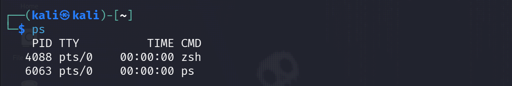

---

### 2. ps aux

Displays detailed information about all running processes.

#### Screenshot

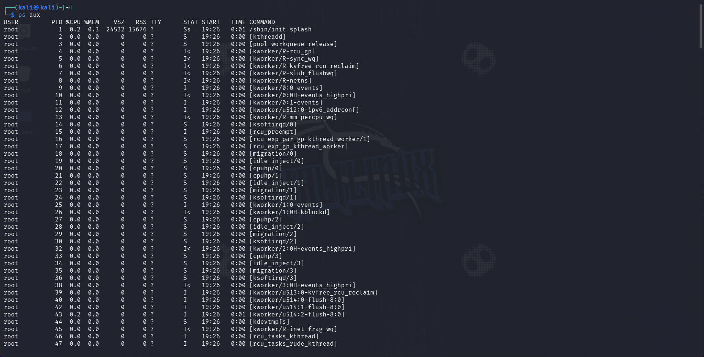

---

### 3. top

Displays real-time process and resource usage information.

#### Screenshot

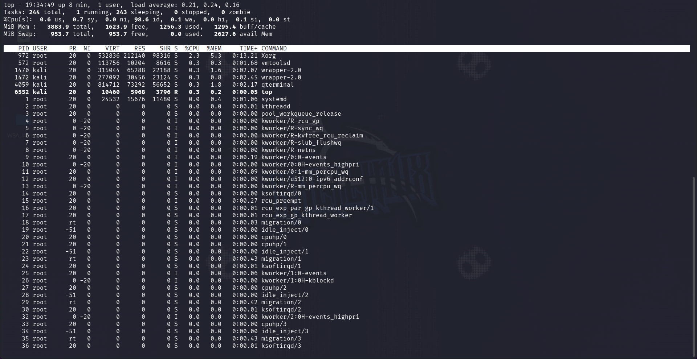

---

### 4. htop

Interactive process monitoring tool.

#### Screenshot

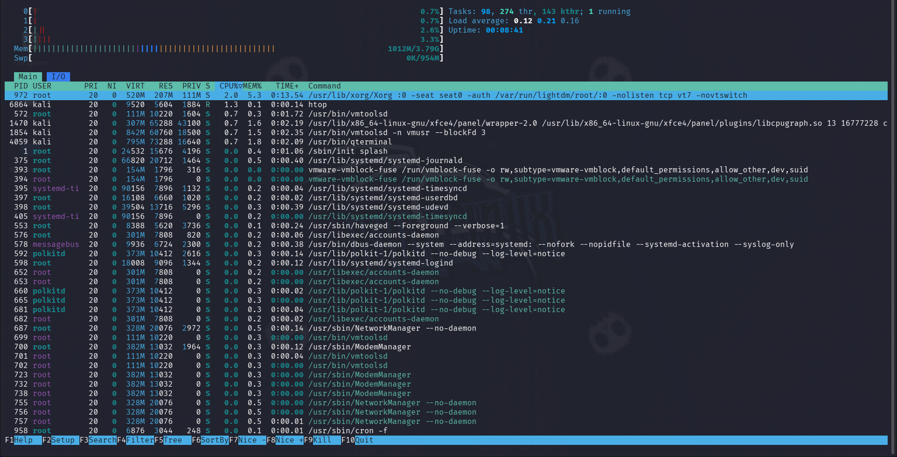

---

## Answers

### What is a Process?

A Process is a program that is currently running on a Linux system. Every command, application or service executes as a process.

### What is a PID?

PID stands for Process Identifier. It is a unique number assigned by the operating system to every running process.

### Which Process is Consuming the Most CPU?

Refer to the top or htop screenshot and record the process showing the highest CPU usage.

### Which Process is Consuming the Most Memory?

Refer to the top or htop screenshot and record the process showing the highest Memory usage.

---

# Part B - Process Management

## Create a Process

Command:

```bash
sleep 300
```

## Find the Process

Command:

```bash
ps aux | grep sleep
```

#### Screenshot


---

## Terminate Process

Command:

```bash
kill PID
```

#### Screenshot

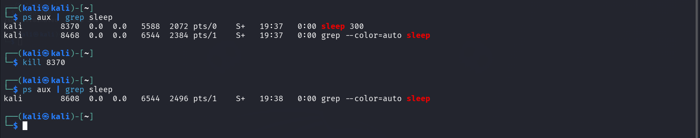

---

## Force Terminate Process

Command:

```bash
kill -9 PID
```

#### Screenshot

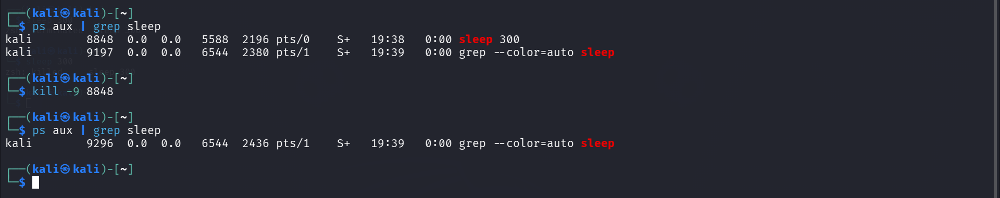

---

## Documentation

### PID Found

Record the PID from your screenshot.

### Command Used

```bash
kill PID
```

### Result

The sleep process was terminated successfully.

---

# Part C - System Monitoring

## 1. free -h

Displays memory usage information.

#### Screenshot

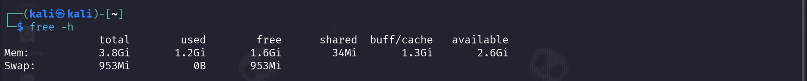

---

## 2. df -h

Displays disk usage information.

#### Screenshot

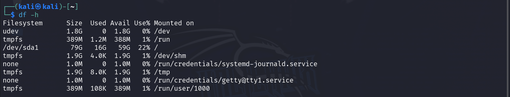

---

## 3. uptime

Displays system uptime information.

#### Screenshot


---

## 4. uname -a

Displays kernel and operating system information.

#### Screenshot

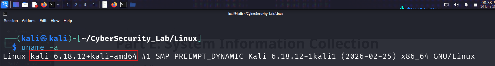

---

## System Summary Report

### Total RAM

Record value from free -h output.

### Available RAM

Record value from free -h output.

### Disk Usage

Record value from df -h output.

### System Uptime

Record value from uptime output.

### Kernel Version

Record value from uname -a output.

---

# Part D - Service Monitoring

## SSH Service Status

Command:

```bash
systemctl status ssh
```

#### Screenshot

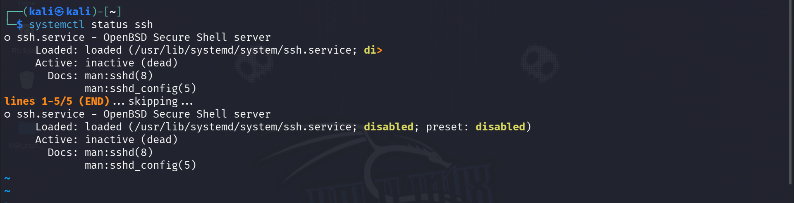

---

## NetworkManager Service Status

Command:

```bash
systemctl status NetworkManager
```

#### Screenshot

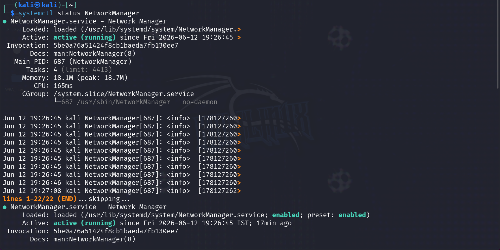

---

## Answers

### What is a Service?

A Service is a background program that performs specific tasks without direct user interaction.

### Why are Services Important?

Services provide essential functionality such as networking, remote access, file sharing and system management.

### How Can a Stopped Service Affect a System?

A stopped service can make its functionality unavailable. For example, if SSH is stopped, remote login will not work.

---

# Part E - Shell Scripting

## Script Creation

#### Screenshot

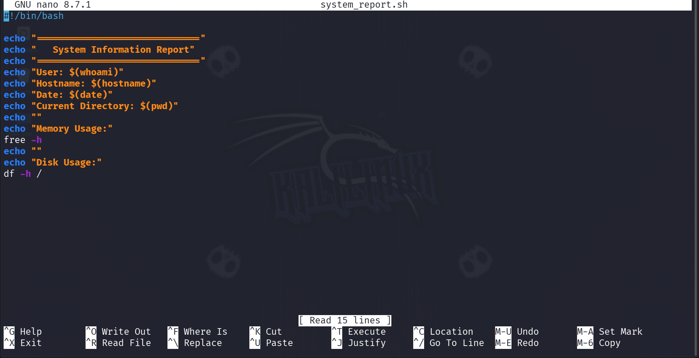

---

## Script Content

```bash
#!/bin/bash

echo "=============================="
echo "   System Information Report"
echo "=============================="

echo "User: $(whoami)"
echo "Hostname: $(hostname)"
echo "Date: $(date)"
echo "Current Directory: $(pwd)"

echo ""
echo "Memory Usage:"
free -h

echo ""
echo "Disk Usage:"
df -h /
```

---

## Script Execution

#### Screenshot

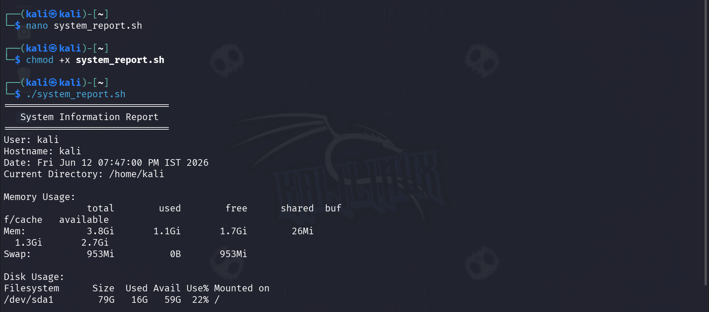

---

## Shell Scripting Explanation

### What is a Shell Script?

A Shell Script is a text file containing a sequence of Linux commands executed automatically by the shell.

### Why are Shell Scripts Useful?

* Automate repetitive tasks
* Save time and effort
* Reduce human errors
* Simplify administration tasks
* Improve productivity

---

# Part F - Security Monitoring Challenge

## 1. netstat

### Purpose

Displays network connections, routing tables and listening ports.

### Security Use Case

Used to identify suspicious connections and open ports.

#### Screenshot

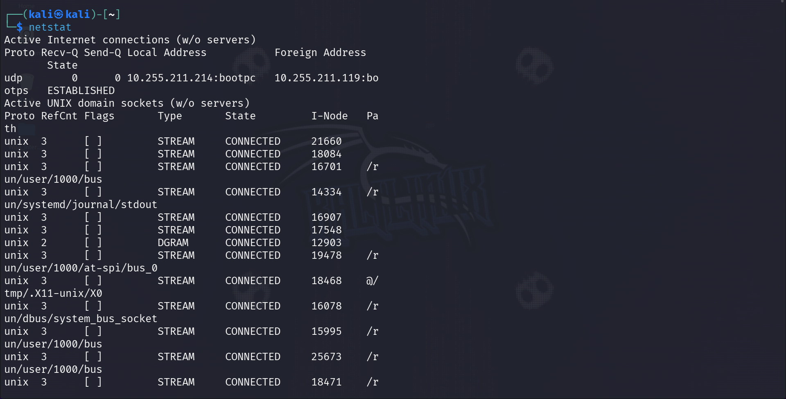

---

## 2. ss

### Purpose

Displays socket and network connection information.

### Security Use Case

Used to investigate active network connections.

#### Screenshot

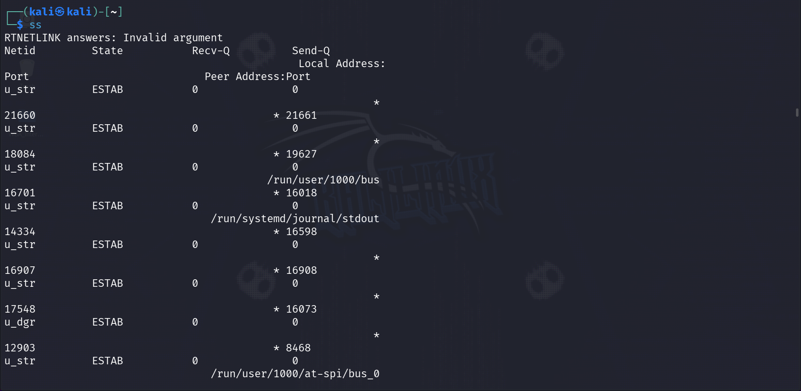

---

## 3. who

### Purpose

Displays currently logged-in users.

### Security Use Case

Used to identify active user sessions.

---

## 4. w

### Purpose

Displays logged-in users and their activities.

### Security Use Case

Used to monitor user activity.

#### Screenshot


---

## 5. last

### Purpose

Displays login history.

### Security Use Case

Used to investigate previous login activity.

#### Screenshot

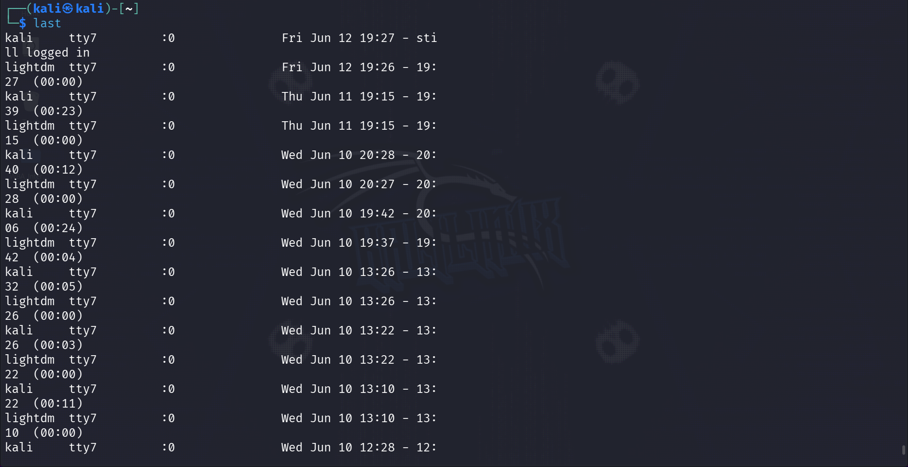

---

# Part G - Mini SOC Activity

## How Would You Identify Resource-Heavy Processes?

I would use commands such as top, htop and ps aux to monitor running processes and check CPU and memory utilization. Processes consuming unusually high resources would be investigated further because they may affect system performance.

---

## How Would You Determine Whether a Process is Suspicious?

I would examine the process name, PID, owner, resource usage, execution path and behavior. Processes with unusual names, unknown origins or unexpected activity may be considered suspicious and require investigation.

---

## What Information Would You Collect Before Terminating a Process?

Before terminating a process, I would collect:

* Process Name
* Process ID (PID)
* User Running the Process
* CPU Usage
* Memory Usage
* Process Start Time
* Command Path

This information helps determine whether the process is legitimate and provides evidence for troubleshooting or security investigations.

---

# Conclusion

This task provided practical experience with:

* Process Monitoring
* Process Management
* System Monitoring
* Service Monitoring
* Shell Scripting
* Security Monitoring
* Basic SOC Analysis

These skills are essential for Linux Administrators, SOC Analysts and Cyber Security Professionals.